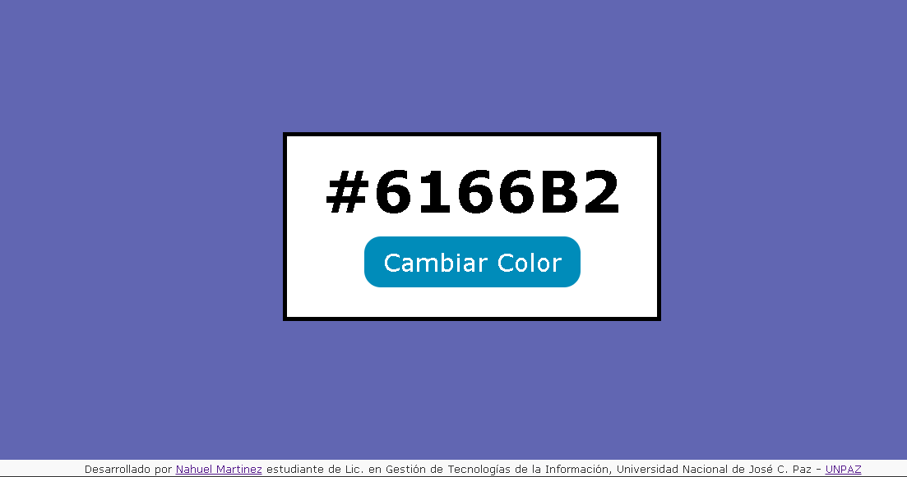
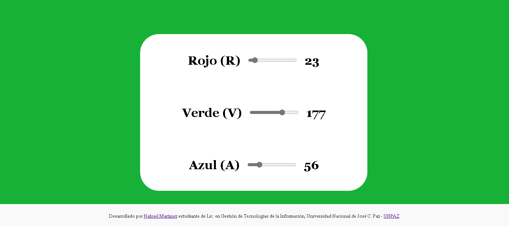
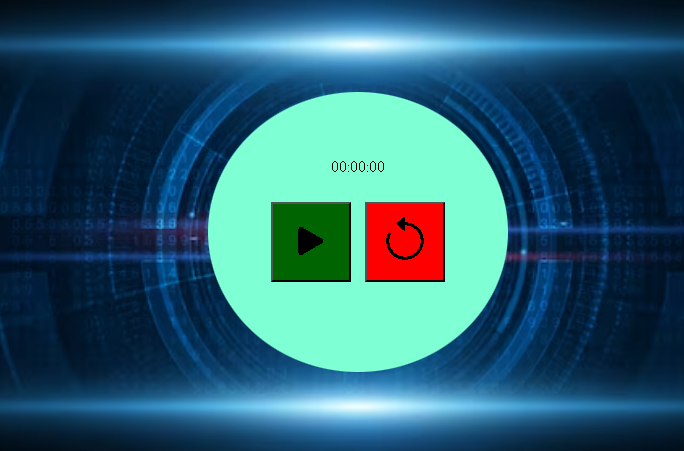
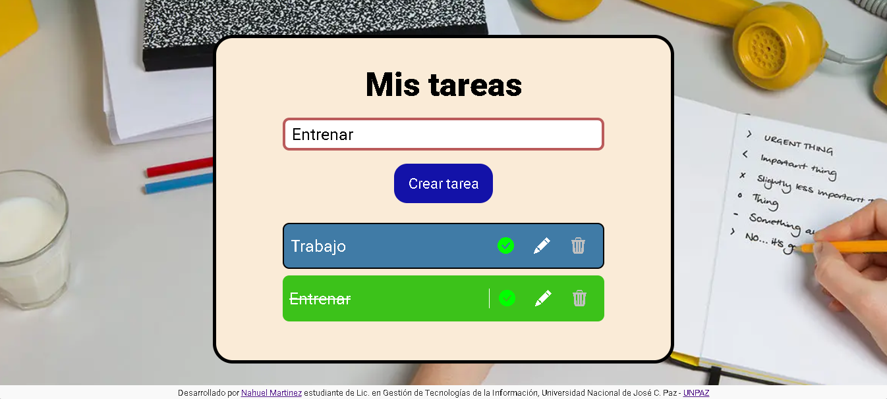
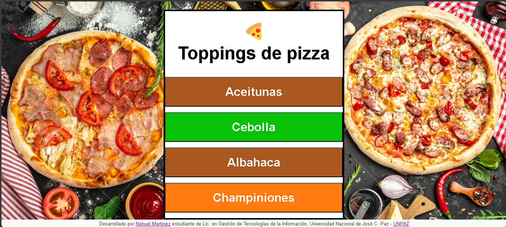

# Proyectos de Manipulación del DOM
Este repositorio contiene **seis proyectos sencillos** creados para demostrar habilidades en la manipulación del DOM. Cada proyecto está diseñado para funcionar de manera independiente y resaltar diversas técnicas para interactuar con el documento mediante JavaScript.

## Proyectos Incluidos

- **Citas Aleatorias 💬:** Muestra citas al azar en cada carga o interacción.

- **Colores Aleatorios 🎨:** Genera y muestra colores aleatorios para experimentar con ellos.

- **Colores RGB Editables 🎚️:** Permite modificar interactivamente los valores RGB de un color.

- **Cronómetro ⏱️:** Un cronómetro básico para contar el tiempo.

- **Lista de Tareas 📋:** Una aplicación sencilla para gestionar tareas pendientes.

- **Topping de Pizza 🍕:** Un proyecto interactivo relacionado con la selección de ingredientes para una pizza.


## Características del proyecto

### 1. Citas Aleatorias 💬
- Este proyecto genera y muestra citas al azar cada vez que cargas la página o realizas una acción. 
- Es ideal para ver en práctica cómo se puede actualizar dinámicamente el contenido del DOM.

### 2. Colores Aleatorios 🎨
- En este proyecto se cambia y muestra el color de fondo de forma aleatoria en valores hexadecimales al precionar el boton. 
- Sirve para demostrar cómo manipular estilos en tiempo real respondiendo a eventos o acciones del usuario.

### 3. Colores RGB Editables 🎚️
- Permite a los usuarios ajustar de manera interactiva los valores RGB mediante controles (como sliders o inputs). 
- Esta aplicación destaca la capacidad de actualizar atributos y estilos en el DOM en función de la interacción del usuario.

### 4. Cronómetro ⏱️
- Un proyecto básico que consiste en un cronómetro. Utiliza funciones de temporización de JavaScript para contar el tiempo y actualizar la interfaz de forma periódica, ejemplificando cómo se pueden ejecutar funcionalidades de forma asíncrona y modificar el DOM.

### 5. Lista de Tareas 📋
- Esta aplicación sencilla permite agregar, eliminar y marcar tareas como completadas. 
- Es una muestra práctica de cómo trabajar con listas dinámicas, responder a eventos (por ejemplo, clics) y gestionar la actualización de elementos en la interfaz.

### 6.Topping de Pizza 🍕
- Un proyecto interactivo en el que el usuario puede seleccionar diferentes toppings para personalizar una pizza. 
- Demuestra cómo manejar interacciones complejas, actualizar visualmente la selección y combinar contenido y estilos de forma dinámica en el DOM.

## Requisitos para usar el proyecto
1. **Descargar de manera local**: Clona este repositorio en tu dispositivo usando el siguiente comando:
   ```bash
   git clone https://github.com/PiernasNegras/ManejoDeDOM.git

Navega a la carpeta ManejoDOM dentro del repositorio.

Abre los archivos HTML con tu navegador favorito.

Autor
Este proyecto fue desarrollado por Nahuel Martínez como parte de mi formación en la Licenciatura en Gestión de Tecnologías de la Información en la Universidad Nacional de José C. Paz. Puedes conocer más sobre mi en mi perfil de [Linkedin.](https://www.linkedin.com/in/nahuel-martinez-7b898a218/)
